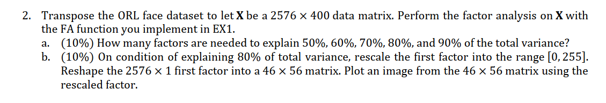

# 2020_Data Analytic

This is the repository mainly includes the codes of the **data analytics courses in NTU, 2020 spring.**

 

 

# Overview

The course mainly consists of several different themes within, which includes:

* **DA01 Preview & Review**
* **DA02 Regression Analysis  ([HW_2](#HW_2))**
  * kruskal_card_game
* **DA03 Multivariate Statistical Inference ([HW_3](#HW_3))**
  * multiple_regression
  * mountain_climbing
  * stepwise regression
* **DA04 Dimension Reduction  ([HW_4](#HW_4)) ([HW_5](#HW_5))**
  * PCA_decomposition
  * Factor Analysis

 

# HW_2

 

# HW_3

 

# HW_4

 

# HW_5

